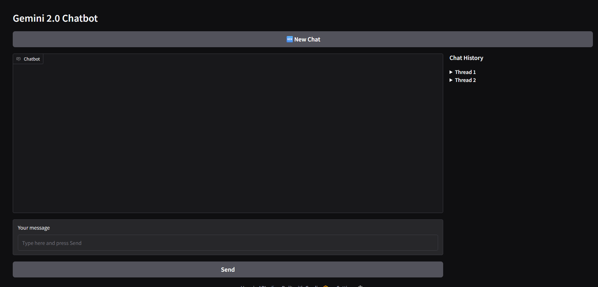
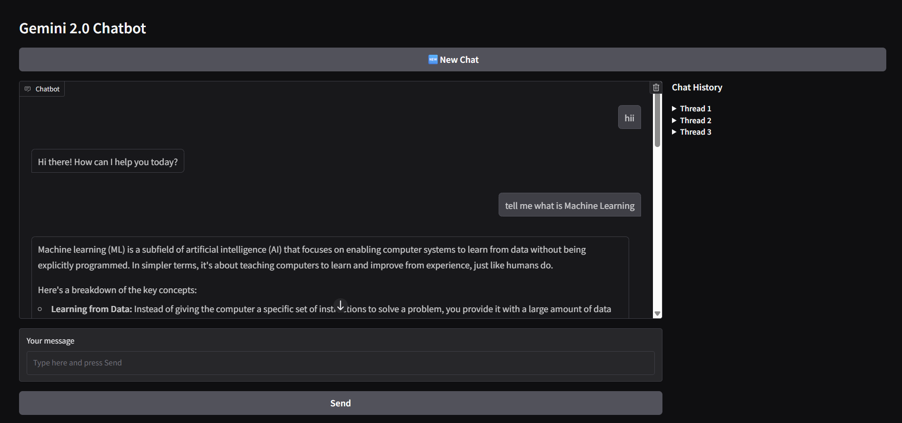

# 🤖 Gemini 2.0 Chatbot

An intelligent AI-powered chatbot built using **Google Gemini API**, **Gradio** for the interface, and **SQLite** for persistent conversation history.

---

## 🚀 Features

- 🧠 Integrated with **Gemini 2.0** to generate smart replies.
- 💬 Real-time chat interface using **Gradio**.
- 🗃️ Saves chat history using **SQLite** (threaded conversations).
- 🆕 Start new conversations anytime with a single click.
- 📜 Side panel with full chat history (collapsible threads).

---

## 🛠️ Tech Stack

| Tech       | Role                            |
|------------|----------------------------------|
| Python     | Main programming language        |
| Gradio     | Web UI interface                 |
| Gemini AI  | AI model for generating replies  |
| SQLite     | Lightweight database for storage |

---

## 📂 Project Structure

```bash
Day_14_CHATBOT/
│
├── Chatbot.py          # Main backend logic
├── chat_history.db     # Auto-created SQLite DB

🧪 How to Run Locally
1. Clone the repository
bash
Copy
Edit
git clone https://github.com/NehaSindhwani01/gemini-chatbot.git
cd gemini-chatbot
2. Install required packages
bash
Copy
Edit
pip install gradio google-generativeai
3. Add your Gemini API Key
In Chatbot.py, replace this line:

python
Copy
Edit
genai.configure(api_key="YOUR-API-KEY")
with your own API key.

4. Run the chatbot
bash
Copy
Edit
python Chatbot.py
Gradio will open in your browser with the chatbot UI.

🖼️ UI Preview




✨ Future Improvements
Add voice input and TTS (Text-to-Speech)

Add user authentication

Export conversation to PDF or text

Deploy online using Hugging Face / Render

🙋‍♀️ Created By
Neha Sindhwani


